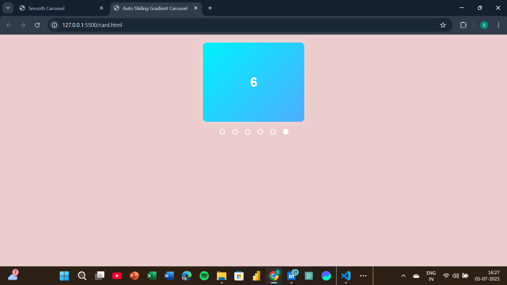
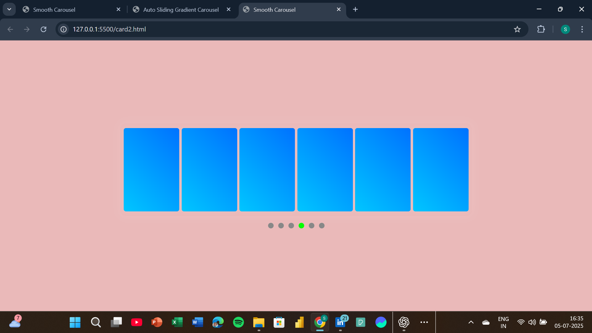
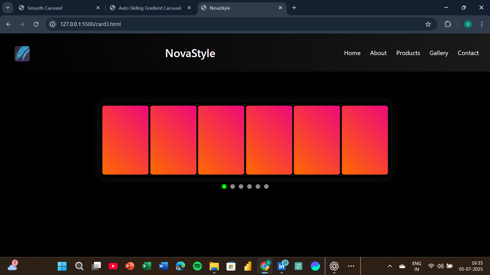

# 🌌  Carousel Project

An animated, responsive **product carousel** developed in **three progressive stages**, showcasing modular UI development with HTML, CSS, and JavaScript—featuring smooth transitions, custom card designs, and an elegant header.

---

## 🔗 Live Demo
> Coming Soon! 

---

## 📚 Project Breakdown

### ✅ Stage 1: Auto-Sliding Gradient Carousel
A minimal sliding carousel with large colorful **main cards** and automatic sliding.

- 🎨 Gradient backgrounds
- 📱 Responsive width using `vw`
- 🎯 Radio dots sync with active slide
- ⏱️ Auto-slide every 2.5s

> File: `card.html`

---

### ✅ Stage 2: Sub-Card Carousel (Product Showcase)
Expanded the carousel to hold **multiple sub-cards** per slide to simulate a real-world product scroller.

- 📦 6 product cards per slide
- 🌈 Different gradients for visual interest
- 🎯 Radio indicators with active styling
- 🧭 Smooth transition animations

> File: `card2.html`

---

### ✅ Stage 3: NovaStyle UI Integration
Combined the carousel with a **website layout**—a stylish header, navigation, and carousel embedded as the homepage focus.

- 🚀 Branding and layout with `NovaStyle`
- 📁 Modular HTML structure
- 🎨 Dark background with neon gradients
- 🖼 Carousel perfectly nested inside the layout

> File: `Nova.html`

---

## 🧰 Tech Stack

| Tech | Purpose |
|------|---------|
| `HTML5` | Structure |
| `CSS3` | Styling and gradients |
| `Vanilla JS` | Carousel logic & interactivity |

---

## 📷 Preview
   
  
  

---

## 🤝 Contribute to project!

🚀 **This project is open for collaboration.**  
If you're a beginner or frontend enthusiast and want to:
- Improve responsiveness
- Add more components
- Clean up code
- Use real product data
- Make the design adaptive

Then you’re welcome to clone, code, and contribute!

## 🚀 Getting Started

1. Clone the repository:
   ```bash
   git clone https://github.com/SHUBBHAM-KUMARR/Carousel.git

2. Move to project directory **cd Carousel**
   

